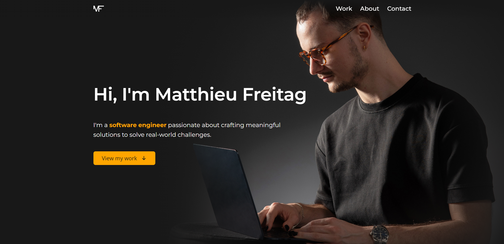

# portfolio-ui

[](https://codecov.io/gh/Zapharaos/portfolio-ui)

Repository related to the UI my own portfolio : www.matthieu-freitag.com/



## Production

### Project Setup

```sh
npm install
```

### Type-Check, Compile and Minify for Production

```sh
npm run build
```

## Development

### Compile and Hot-Reload for Development

```sh
npm run dev
```

Head to [http://localhost:5173](http://localhost:5173) to see the result.

## SEO

All SEO metadata (title, description, Open Graph & Twitter cards, favicons,
JSON-LD structured data, `robots.txt`, `sitemap.xml`, `site.webmanifest`) is
driven by a **single config file**: [`src/config/seo.ts`](src/config/seo.ts).
Edit that one file to make the portfolio your own.

How it works, in two layers:

- **Build time** — [`plugins/vite-plugin-seo.ts`](plugins/vite-plugin-seo.ts)
  injects the config as static tags into `index.html` and generates
  `robots.txt` / `sitemap.xml` / `site.webmanifest`. Static tags are required
  because social-media link scrapers (LinkedIn, Facebook, X, Slack, Discord…)
  and some search-engine crawlers do **not** run JavaScript.
- **Runtime** — [`src/composables/useSeo.ts`](src/composables/useSeo.ts)
  enriches the head with the data fetched from the API (name, description,
  locale, social links) using [`@unhead/vue`](https://unhead.unjs.io/).

### 1. Fill in `src/config/seo.ts`

Every field is documented inline in the file. The most important ones:

| Field | What it is & why it matters | Example |
|-------|-----------------------------|---------|
| `siteName` | Brand name used in `og:site_name` and the title template. | `"Jane Doe"` |
| `siteUrl` | Canonical base URL (no trailing slash). Used for the `canonical` link, absolute `og:image`, the sitemap and robots. **Also set `VITE_SITE_URL`** (see step 2), which overrides this. | `"https://jane.dev"` |
| `defaultTitle` | The `<title>` shown on the home page and in search results / share cards. Keep it short (≈ 60 chars). | `"Jane Doe"` |
| `titleTemplate` | Pattern for sub-page titles; `%s` is the page name. | `"%s · Jane Doe"` |
| `description` | The 1–2 sentence summary shown under the link in Google and in share previews. Aim for ≈ 150–160 chars, no keyword stuffing. | `"Frontend engineer…"` |
| `keywords` | Optional list. Low SEO value today, harmless to keep. | `["portfolio", …]` |
| `locale` | Sets `<html lang>` and `og:locale`. Tells search engines the page language. | `"en"` / `"fr_FR"` |
| `author` | Your name, job title and URL. Feeds the JSON-LD `Person` (rich results). | — |
| `og` | Share image path, its alt text and OG type. See step 3 for the image. | — |
| `twitter` | Card type (`summary_large_image` recommended) and your `@handle` (or empty). | — |
| `themeColor` | Browser UI / mobile address-bar color. | `"#181818"` |
| `icons` / `manifest` | Favicon + PWA icon paths and manifest info. See step 3. | — |
| `robots` | `index` / `follow` toggles. Set `index: false` for a private/staging deploy so search engines skip it. | — |
| `person` | Enables the JSON-LD `Person` block; social links (`sameAs`) are filled automatically from your API socials at runtime. | — |

> Social/share previews come from the **static** tags, so they reflect what is in
> `src/config/seo.ts` — not the live API data. Keep `defaultTitle`,
> `description` and the OG image meaningful on their own.

### 2. Set your site URL

Copy `.env.example` to `.env` and set your production domain:

```sh
VITE_SITE_URL=https://your-domain.com
```

This drives the `canonical` link, the absolute `og:image` URL, `sitemap.xml`
and `robots.txt`. A correct canonical URL prevents duplicate-content issues and
makes share cards resolve the image reliably.

### 3. Add your image assets

These files must live in [`public/`](public/) — **not** `src/assets/`. `public/`
files are served as-is at a stable, root-relative URL (`/icon-512.png`) without
bundler hashing, which is exactly what `index.html`, the web manifest and external
crawlers/social scrapers need. `src/assets/` is only for images `import`ed inside
components (Vite hashes and optimizes those). These assets are **referenced by the
config, not generated**:

| File | Size | Purpose |
|------|------|---------|
| `og-image.png` | 1200×630 | Social share preview (LinkedIn, X, Slack…). |
| `logo.ico` (or your `favicon`) | 32×32 / 48×48 | Browser tab favicon (already shipped). |
| `apple-touch-icon.png` | 180×180 | Home-screen icon on iOS. |
| `icon-192.png` | 192×192 | PWA / Android icon. |
| `icon-512.png` | 512×512 | PWA / Android icon **and** the brand mark on the `/og` card. |

If you rename any file, update the matching path in `src/config/seo.ts`
(`og.image`, `icons.*`).

#### Optional: generate the Open Graph image from your hero

In development a dedicated route, [`/og`](http://localhost:5173/og), renders a
1200×630 card built from your **hero** data (see
[`OgImage.vue`](src/components/OgImage.vue)). You can open it in the browser and
screenshot it, or let the helper do it for you:

```sh
npm i -D playwright && npx playwright install chromium   # one-time
npm run og:generate                                      # writes public/og-image.png
```

The helper starts the dev server, opens `/og` and screenshots the card, so the
backend API (`VITE_API_URL`) must be running to load the hero data. The `/og`
route and this script are dev-only (not part of the production build or CI) — you
can always provide your own `public/og-image.png` instead.

### 4. Submit your site to search engines

Search engines find you faster if you tell them your site exists and hand them
the sitemap:

- **Google Search Console** — <https://search.google.com/search-console>
  1. Add your property (domain or URL prefix) and verify ownership.
  2. Open **Sitemaps** and submit `https://your-domain.com/sitemap.xml`.
  3. Use **URL Inspection** to request indexing of your home page.
- **Bing Webmaster Tools** — <https://www.bing.com/webmasters> (same idea; you
  can import your settings from Google Search Console).

Indexing can take anywhere from hours to a few days.

### 5. Validate before sharing

After deploying, check that the metadata is picked up correctly:

- **Rich Results Test** (JSON-LD / structured data) —
  <https://search.google.com/test/rich-results>
- **OpenGraph preview** — <https://www.opengraph.xyz/>
- **LinkedIn Post Inspector** — <https://www.linkedin.com/post-inspector/>
  (also forces LinkedIn to refresh its cache of your page).
- **Facebook Sharing Debugger** — <https://developers.facebook.com/tools/debug/>

If you change the OG image or title later, re-run these debuggers so the social
networks refresh their cached preview.

## Analytics

Optional, privacy-friendly, **cookieless** analytics via
[umami](https://umami.is) — no consent banner needed. Like SEO, it is driven by a
**single config file**: [`src/config/analytics.ts`](src/config/analytics.ts),
fed by `VITE_UMAMI_*` env vars.

It is **off by default**: with no `VITE_UMAMI_HOST` / `VITE_UMAMI_WEBSITE_ID` set,
no tracker is injected and the site ships zero tracking. To enable it, point it at
your umami instance:

```dotenv
VITE_UMAMI_HOST=https://analytics.example.com
VITE_UMAMI_WEBSITE_ID=xxxxxxxx-xxxx-xxxx-xxxx-xxxxxxxxxxxx
```

Set `VITE_UMAMI_ENABLED=false` to turn it off without clearing the ids. Full
setup (self-hosting, first-party mode to dodge ad-blockers, custom events) is in
[`docs/analytics.md`](docs/analytics.md).

## License

All code is licensed under the MIT License. See [LICENSE](./LICENSE) file for
details.