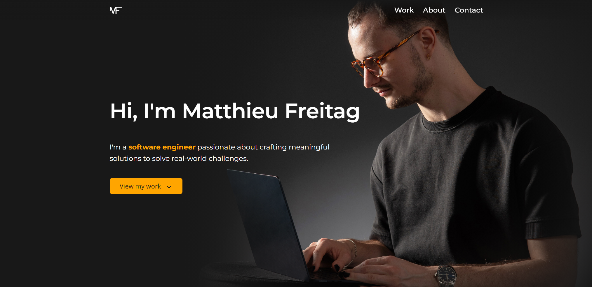

# portfolio-ui

[](https://codecov.io/gh/Zapharaos/portfolio-ui)

Repository related to the UI my own portfolio : www.matthieu-freitag.com/



## Production

### Project Setup

```sh
npm install
```

### Type-Check, Compile and Minify for Production

```sh
npm run build
```

## Development

### Compile and Hot-Reload for Development

```sh
npm run dev
```

Head to [http://localhost:5173](http://localhost:5173) to see the result.

## License

All code is licensed under the MIT License. See [LICENSE](./LICENSE) file for
details.